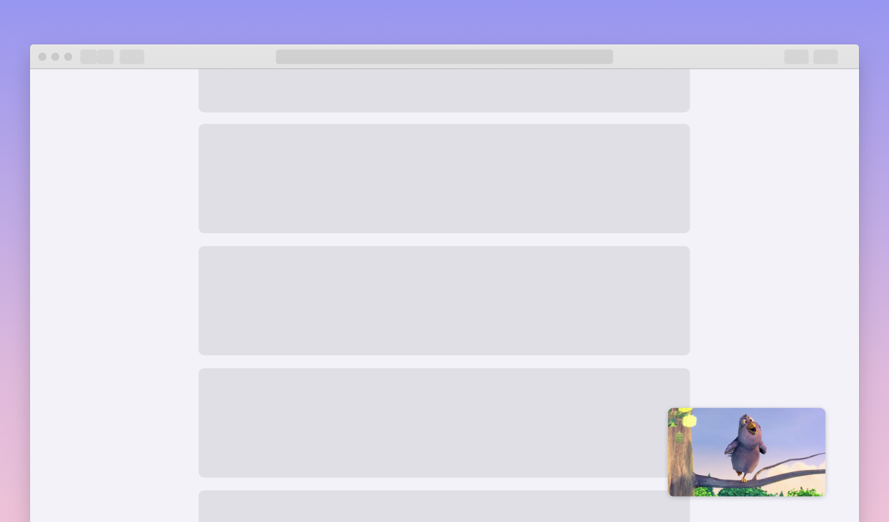

# Amazon IVS React Mini-Player Demo

A demo web application intended as an educational tool for demonstrating how you can implement a mini-player ("floating player") as a React component, using the Amazon IVS Player SDK.

**This project is intended for education purposes only and not for production usage.**

This project was bootstrapped with [Create React App](https://github.com/facebook/create-react-app).

## Getting Started

In the project directory, run:

### `yarn start`

Runs the app in the development mode.  Open [http://localhost:3000](http://localhost:3000) to view it in your browser.

The page will automatically reload as you make edits.  You will also see any lint errors in the console.

### Using your own Live stream

To load your own Amazon IVS stream, you will need to modify `STREAM_PLAYBACK_URL` in the `App.jsx` file, to point to your own channel's PlaybackURL.

## About Amazon IVS
Amazon Interactive Video Service (Amazon IVS) is a managed live streaming solution that is quick and easy to set up, and ideal for creating interactive video experiences. [Learn more](https://aws.amazon.com/ivs/).

* [Amazon IVS docs](https://docs.aws.amazon.com/ivs/)
* [User Guide](https://docs.aws.amazon.com/ivs/latest/userguide/)
* [API Reference](https://docs.aws.amazon.com/ivs/latest/APIReference/)
* [Setting Up for Streaming with Amazon Interactive Video Service](https://aws.amazon.com/blogs/media/setting-up-for-streaming-with-amazon-ivs/)
* [Learn more about Amazon IVS on IVS.rocks](https://ivs.rocks/)
* [View more demos like this](https://ivs.rocks/examples)

## Security

See [CONTRIBUTING](CONTRIBUTING.md#security-issue-notifications) for more information.

## License

This library is licensed under the MIT-0 License. See the LICENSE file.